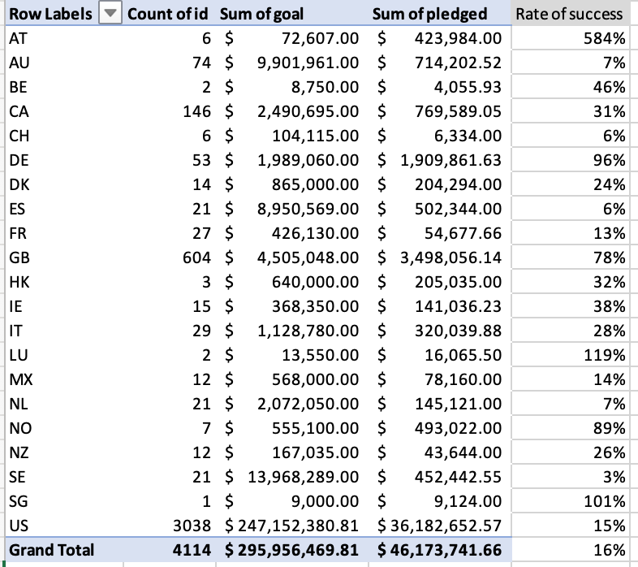

## Kickstarter Analysis
 Kickstarter analysis is the analysis of dataset that will help Louise achieve her fundraising goal.
 
The purpose of the Kickstarter analysis is to analyze the dataset and draw various conclusions that will help Louise determine how to successfully accomplish her fundraising goal for her play "Fever".

### Analysis and Challenges

Through the data analysis of theater campaigns launching time and their outcomes for each month, we understand that May and June have the highest number of successful campaigns. However, it is noticable that these months also have the highest number of failed campaigns, yet, the percentage of failed versus successful campaigns is smallest compared to the rest of the months. In addition, based on the dataset analysis, December is the least successful month with the highest percentage of failed versus successful campaigns. Overall, the best months for Louise's play to take place will be May and June.

The chart below shows the rate of plays campaign outcomes (successful, failed, and canceled) over various goal ranges. The chart helps us understand that the plays with a goal range of less than $1,000 have the most successful outcomes (75.81%) and the plays with the goal range of $45,000 to $49,999, are the least successfull with 100% fail rate. Since Louise's goal is to raise $10000+, her chance of successfully achieving the goal is 54.17% based on the kickstarter analysis dataset.

One data limitation with the dataset analysis has to do with Live outcomes, which we cannot draw conclusions on. The Live outcomes represent plays that are ongoing and we will have to wait for the plays to conclude before considering them in our analysis.

By using the kickstarter dataset, another possible table that we can create is total number of events per country. By creating a pivot table of countries, ids, goals, pledged, and outcomes, we can draw further conclusions regarding countries with the most shows, most and least successful countries, countries with the most events, and countries with the most pledged amount. This dataset analysis will provide Louise with further possibilities to successfully achieve her goal.

